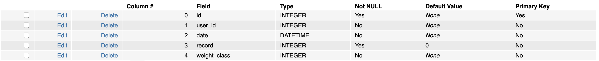
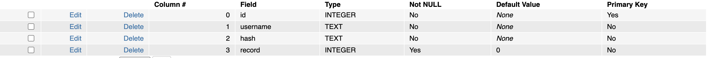

# Weightlifting tracking and motivation web application
#### Video Demo:  <https://youtu.be/5ZRVhp2Jz00>
#### Description:
Website features:
The website enables a user to register an account.
The password needs to comply with certain security standards as at least one number, one upper letter and be at least 8 digits.
After setting up an account, the user can read details about olympic weightlifting and it´s two different exercises (Snatch and Clean & Jerk).
The user can track their progress by typing in their personal record and choose their current weight class.
This will output a comparison with the current world record holders in that weight class. The data is always up to date.
The user can also look at all the historic personal records already submitted. By default those record are displayed by submitted date, but the user has the chance to sort by personal record (highest first) or weight class (lowest first).
The user can log out as well.

#### Technology used:
This web app was built using Flask (Python), SQLite3 for the database, CSS and html.
For visual appealing effects, bootstrap elements were used.
Further, input and examples from https://www.w3schools.com was used.
For some function like register and login, I build on the functions we learned troughout the CS50 class, especially with the last project (finance).

#### Description of the files:
**/statis/style.css** is the stylesheet referenced in layout.html to make the website visual more appealing. It uses bootstrap elements an helps creating the navigation bar on the left site of the website.

Within /templates:

**layout.html** is the basic html document on which all the others extend. In it, the navigation bar on the left side is build by using bootstrap elements. The flash messages are implemeted here as well by using a python script that checks the category of the error message. It can either be "error" or "success" and will pop up in a different color (red or green) accordingly.

**clean_jerk.html** describes all the individual steps that need to be completed to finish the clean and jerk exercise within the html tags. Furthermore, CSS is used to make the presentation of the content visually more appealing.

**snatch.html** is very similar to clean_jerk.html only differs in the content itself.

**index.html** is a very simple html document that greets the user without any further functions.

**register.html** consists of a html form that takes input as username, password and the confirmation of the password and a submit button.

**login.html** is similar to register without the (password) confirmation field.

**overview.html** is a very basic html file that describes olympic weightlifting, it´s cited from wikipedia and contains a link to the source itself.

**total.html** consists of a html form that takes to inputs, the user submitted record (it only takes int) and a drop down with which the user can choose the according weight class plus a button to submit it.

**record_show.html** is a very short but import html file for this web app as it takes the input submitted by the user (weight-class and record) plus the world record in this weight class and displays it to the user as a result after user inputed it into total.html

**pr.html** is the backbone of the whole web app as it is where the magic is being displayed. A python script checks if the record database is empty, if so the table does not get displayed. If there are records, a table with the user records is being displayed. A python script therefore checks the database row by row and extends it as much as possible. A bit of CSS makes the buttons visually more appealing when clicking on it, the button moves a bit and changes its color. Furthermore, a Javascript enables the user to sort the table either by weight or weight class (by default it is sorted by date submitted). The Javascript is triggered once the buttonis clicked.
The application itself:

**app.py** is the backbone of the whole application as most of the computation happens here. First of all, a variety of libraries and functions are imported. The first party heavily build on the knowledge and functions learned in the last project in CS50 (finance). The app is being configured, ensured that templates are auto-reloaded and the session uses filesystem instead of signed cookies.
After that the database is being set up. The second database and further tweaks are being made in PHPLiteAdmin GI directly. Several routes are being set up. index, overview, snatch, clean_jerk lead to the named html file without further functions or steps being executed.
*register* checks if the user submits via POST method (if the user submits the form). If so, the username, password and confirmation input from the html file are stored into variables as used more often down the road. This function also checks if the usser provided a username, a password, a minimum length for the password, if the password contains at least 1 number, 1 upper case a confirmation and if the password matches the confirmation. If all those criteria are met, a password hash is being created. It further checks the db if the username already exists, if not, the username and it´s corresponding password (secured in a hash) are stored into the database and the user is being redirected to the index page with a successful flash message. If one of the criteria is not met, a flash message will pop up displaying the reason for the error.
If a user reaches that pages via GET (reaching that site by clicking on the a link or on the register field in the nav bar) it will lead to the register page.
*login* checks if user submits via POST or GET. First of all it clears the session to forget any user_id. If user reaches site via POST aka submitting the form, usernam and password are stored in a variable as used more often down the line. It checks if the user has provided a username and password. if not an error messages appears. Further, the password is checked. If the hash does not match, an error message will appear. If everything provided macthes, the user will be loged in and the session starts. The user will see a sucessful pop up and will be redirected to the start.
*logout* is pretty straight forwarded, clears all sessions and forwards to the home screen of the website.
*total* differentiates between POST and GET methods again. If the user submits the form provided in the correspodning html, record and weight are being stored into variables. Weight will be converted to a str. If user did not provide a record but submits the form, an error message will appear. By default the lowest weight-class is chosen (55kg). User session is stored in a variable as used more often down the line. The date is stored into a variable. Further, user_id, record, date and weight_class are stored into the history database. Users database will be updated as well with the new personal record followed by a successful flash message. The user will be redirected to record_show.html via record_finder function which is build in helpers and imported and explaned in more detail later. If user reaches our via GET (clicking on link but not submiting yet) the total.html will show and let the user provide all the input (record and weight class).
*pr* stores the user session again in a variable. Further it selects and stores the record from users database where the user_id (from the session) macthes the database. It also select and stores record, date and weight_class from history database where the user_id matches the session user_id. This information will be handed to and displayed in the pr.html via render_template function.

In **helpers.py** I created a function called *record_finder* that get´s the current world record data about weight lifting directly from wikipedia. Therefore I inported pandas and changed the data structure a bit by adding a first row and a column with weight classes and re-naming some columns. The function further helps to take the user input and display the record_show.html with the current world record. I deliberately choose to call this function everytime instead of creating a static database with world records so I do not need to worry that the database is not up to date.

**database.db** consists of two Tables. The first table is users which consists of 4 fields. id (INT and primary key), username (STR), hash(STR), record (INT). The second table is called history and it´s structure consists of 5 fields. id (INT and primary key), user_id (INT), date (datetime), record (INT), weight_class (INT).

**project.js** is a Javascript function from bootstrap for the navigation bar.

**Further features:**
There are a lot of features I would like to implement further.
On a technical level I would like to check if the database exist, if not it will be created. Further, storing the newest record in the users table as well seems to be unnecessary but to keep the same user functionality getting rid of it would require re-writing some of the code logic to fetch and display the data like this to the user. Therfore I left it like this for now.
Further I would like to have the ability to store the record for each exercise individually (snatch and Clean & Jerk) with an automated calculation of the total value. Furthermore, the user could have the posiility to choose the gender and get the gender specific world record displayed. An explanation of the exercises with video or picture format would increase the user experience as well.
Within the table, having the option to select and only show specific timeframes, weight classes and further exercises would round up the functionality for this the web app.

If you see this project, I hope you enjoy it. Happy to receive feedback for further improvements.
